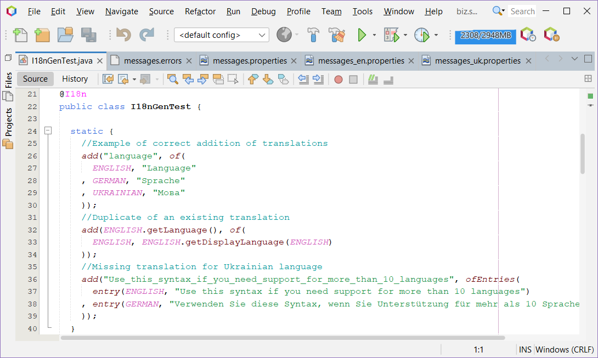

[](license.md)
[](https://mvnrepository.com/artifact/biz.softfor/biz.softfor.spring.i18ngen)
[](https://github.com/ovsyannykov/biz.softfor.i18ngen/actions/workflows/maven.yml)

[](readme.md)
[](readme.ru.md)

<h1 align="center">biz.softfor.i18ngen</h1>



— це утиліта для генерації messages-файлів локалізації. Використовуючи її, Ви:
1. Групуєте всі відповідні одному ключу переклади в одному місці, завдяки чому
2. Ви бачите відсутні переклади і не робите дублікатів.
3. Ви постачаєте зроблені переклади разом зі своїм кодом, що дає можливість
4. Перевикористовувати та додавати підтримку нових мов.
5. Ви отримуєте автоматичний звіт про дублікати та відсутні переклади!

## Приклад використання

Для кожного артефакту з рядками, які потрібно виводити різними мовами,
створюємо паралельний артефакт із залежністю:
```xml
<dependency>
  <groupId>biz.softfor</groupId>
  <artifactId>biz.softfor.i18ngen</artifactId>
  <version>${biz.softfor.i18ngen.version}</version>
</dependency>
```
і з класом(ами) такого виду:
```java
import biz.softfor.i18ngen.I18n;
import static biz.softfor.i18ngen.I18nGen.UKRAINIAN;
import static biz.softfor.i18ngen.I18nGen.add;
import static java.util.Locale.ENGLISH;
import static java.util.Locale.GERMAN;
import static java.util.Map.entry;
import static java.util.Map.of;
import static java.util.Map.ofEntries;
...
@I18n
public class SampleI18n {

  static {
    add(Sample.Language, of(
      ENGLISH, "Language"
    , GERMAN, "Sprache"
    , UKRAINIAN, "Мова"
    ));
    add(Sample.Use_this_syntax_if_you_need_support_for_more_than_10_languages, ofEntries(
      entry(ENGLISH, "Use this syntax if you need support for more than 10 languages")
    , entry(GERMAN, "Verwenden Sie diese Syntax, wenn Sie Unterstützung für mehr als 10 Sprachen benötigen")
    , entry(GERMAN, "Використовуйте цей синтаксис, якщо потрібна підтримка понад 10 мов")
    ));
  }

}
```
і анотуємо його інструкцією @I18n.

Отже, ми згрупували наші переклади за ключами, класами та артефактами. Але як
тепер їх усі прочитати та згенерувати потрібні нам файли? У цьому нам допоможе
**gmavenplus-plugin**! У pom-файл вже Вашої багатомовної програми
у секцію ```<build><plugins>``` додаємо такий код:
```xml
<build>
  <plugins>
    <plugin>
      <groupId>org.codehaus.gmavenplus</groupId>
      <artifactId>gmavenplus-plugin</artifactId>
      <dependencies>
        <!-- Тут перераховуємо залежності з нашими перекладами, наприклад: -->
        <dependency>
          <groupId>biz.softfor</groupId>
          <artifactId>biz.softfor.partner.i18n</artifactId>
          <version>0.0.0</version>
        </dependency>
        <dependency>
          <groupId>biz.softfor</groupId>
          <artifactId>biz.softfor.user.i18n</artifactId>
          <version>0.0.0</version>
        </dependency>
        <dependency>
          <groupId>biz.softfor</groupId>
          <artifactId>biz.softfor.util.i18n</artifactId>
          <version>0.0.0</version>
        </dependency>
      </dependencies>
      <executions>
        <execution>
          <id>generate-resources</id>
          <phase>generate-resources</phase>
          <goals>
            <goal>execute</goal>
          </goals>
          <configuration>
            <scripts>
              <script><![CDATA[
                String baseDir = project.properties.getProperty('project.basedir').replace('\\','/');
                biz.softfor.i18ngen.I18nGen.genMessages(
                  baseDir + "/target/classes"
                , baseDir + "/target/log"
                //Перераховуємо локалі, для яких генеруватимемо messages*.properties файли. Перша локаль – локаль за замовчуванням.
                , "de,en,uk"
                //В даному випадку можна було б обмежитися "biz.softfor", але з метою демонстрації перерахуємо пакети з анотованими класами @I18n:
                , "biz.softfor.util"
                , "biz.softfor.user.i18n"
                , "biz.softfor.address.i18n"
                , "biz.softfor.partner.i18n"
                );
              ]]></script>
            </scripts>
          </configuration>
        </execution>
      </executions>
    </plugin>      
  </plugins>
</build>
```
В результаті в папці проекту "target/classes" отримаємо наші файли перекладів,
та за наявності дублікатів або відсутніх значень у папці "target/log" звіт
з іменами файлів та номерами рядків.

## Ліцензія

Цей проект має ліцензію MIT - подробиці дивіться у файлі [license.md](license.md).
